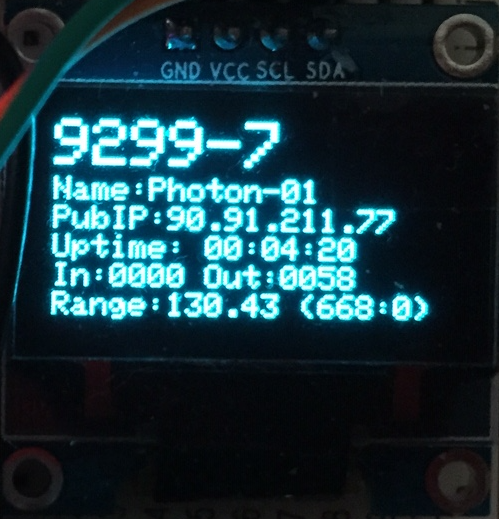
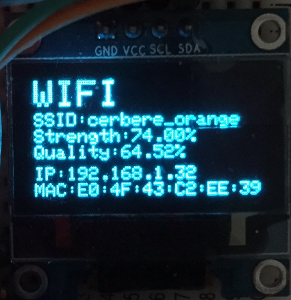
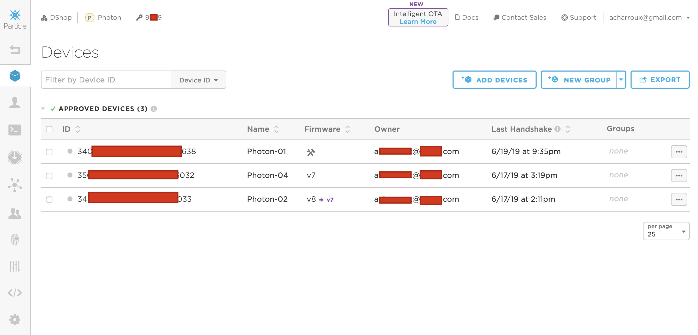
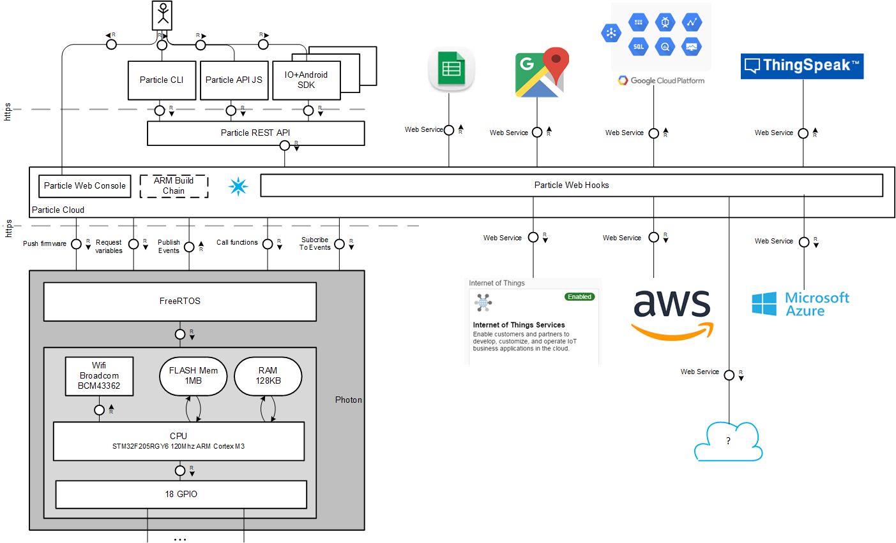

# Purpose
I like Particle and their devices (Photon as well as new generation ie Argon/Xenon) very much. I think there is a serious gap between the world of makers and the world of production. One breadbord is cool when it is in your desk. Managing 100 instances of an actual industrial product is another story :

* How to monitor/control a device running at say, Vladivostok (no offense, Valdisvostok ...)? 
* How to update it ? 
* What about updating 100 devices ? 1000 ? 
* How to deal with the data 1000 devices are constantly producing ?

Particle tries to answer all these questions with their Particle Cloud software and devices ...

So, here is a workshop about the main features of Particle Cloud. Idea is to build a simple IOT product step by step. Each step tries to demonstrate an important feature of Particle Cloud.
Targeted audience is definitely developpers/architects.

# Disclaimers
I am a software engineer. Very very software oriented. After years (gosh ! I was even part of the first Internet bubble) of developing C++ code around DBMS connectivity & Machine Learning, I have discovered IOT ant its simple pleasures : Max 100 KB of RAM, simple C code, possibly C++, measure something real, trigger a physical action (Look ! the LED lit on!!).

All that to explain the hardware is not my best skill (the fitzing schema clearly demonstrates it) and this presentation is **not** about generally coding on micro-controllers neither specifically dealing with a SR-04 or an OLED screen but **really** about high level Particle Cloud's features.

I will say say a lot of good things about Particle and its Cloud. Note I am not related to Particle company in **_any_** way.

The best part of the fritzing schema is coming from https://github.com/tonyranieri/Photon-HC-SR04.

To be complete, note all IDS & access tokens visibles in this workshop have been randomized or obfuscated :)

# Design an IOT product using Particle Cloud & Photon
## The Hardware
The hardware is very cheap so it is possible to build several devices. For each instance, you will need:
* a Photon: A 3rd generation hardware like Argon or Xenon should work as well.
* a basic SR-04 sonar: Not very precise neither consistant but you can buy a bunch of SR-04 at ebay for almost nothing. And there is a photon library to manage it.
* a small OLED screen 128x64 using I2C: Very cheap too and standard Adafruit's SS1306 library is working like a charm on the photon.
* 2x470 ohms resistor: looks like optional. Plenty of sketches with SR-04 are not using it


The whole Fritzing file is [here](./Resources/sketch.fzz)

You have to build at least 2 instances of this hardware:
* one will be used for development. 80 % of this workshop is using only this dev device
* one will be used to demonstrate deploiement on production

The more production instances you will build, the more dramatic last steps of this workshop will be.
## Basic features of the product
* SR-04 measure distances every 100 ms
* A valid range is a distance between 15 cm & 25 cm for at least 10 measures
* A valid range is signaled by the Photon's LED flashing red for 200 ms
* The OLED screen is able to display 2 panels:
    * *Software panel*
        * the version of the firmware
        * The Photon's name
        * The Photon's public IP address
        * The uptime
        * The last measure (valid or not) & the # of valid ranges
        * The # of events (received and sent)
    * *WIFI panel*
        * The WIFI's SSID
        * Strength & quality of WIFI signal
        * The Photon's IP address on the WIFI
        * The Photon's Mac address




## Cloud features
Final version of the product's firmware will be fully cloud and will manage/react to a set of variables, functions and events.

Cloud Feature | Name | Payload | Comment
--------------|------|---------|--------
Variable|`cm`| N/A| Value of last range (valid or not)
Function|`ChangePanel`|string:`Software` or `Wifi`|Change the current panel of the target device
Subscribed Event|`ChangePanel`|string:`Software` or `Wifi`|Change the current panel of all product's devices
Subscribed Event|`WhoIsConnected`|N/A|Fired back an event `Connected`
Subscribed Event|`ForceOTA`| N/A| Force a system reset so last OTA will be activated
Published Event|`PanelRequested`|string:`Software` or `Wifi` | sent when a panel has been asked 
Published Event|`UnknownPanelRequested`|string:Name of the unknown panel|published when an unknown panel has been requested
Published Event|`ValidRange`|float:Value of last valid range|
Published Event|`OTARequested`| N/A| Fired after `ForceOTA` has been received
Published Event|`Connected`|string:JSON dump of Software Panel

To be complete, there also a couple of events that are processed to get some infos about the Photon. This is a purely internal (and documented) trick used to workaround the lack of simple API to get these infos. Best is probably to avoid to talk about that strange way of doing simple things ...

Cloud Feature | Name | Payload | Comment
--------------|------|---------|--------
Event|`particle/device/name`| string:Photon's Name|
Event|`particle/device/ip`| string:Photon's IP|

## Product firmware step by step
The workshop will start with a basic, partial firmware and step by step, add more and more cloud features into a final production firmware.
### Step 1: Manage the sonar, Cloud compilation and Cloud variables
Demonstrate web ide, cloud compilation and Cloud variables and obviously, manage the sonar hardware.
### Step 2: Manage the OLED screen, Cloud Events and Cloud functions
Manage OLED scren and start to play with subcriptions to Events and Cloud Functions.
### Step 3: Manage Sonar as well as OLED screen
Merge the 2 previous firmware. Some convenient events will be added too.
### Step 4: Define a Cloud Particle Product
Add the only 2 lines necessary to manage a whole product and its fleet of devices.
### Step 5:Manage data generated by a fleet of devices & Cloud integration
A fleet of devices generates a serious bunch of data. Time to enlight the power of Particle Cloud integration.
# Global setup and prerequisites
You should have at least 2 instances of the hardware.
1. Elect the one that will be your main development board. Most of the time, you will interact with it
2. Keep some precious informations about this device
    * Name of the photon ex: *`Photon-01`*
    * It's ID ex: *`340041001447353236343033`*
    * Your access token ex: *`fc0d5e2a5a1a62b537783b58c0726f5fa8841885`*
3. It's a good idea to reset its firmware with for example, the tinker firmware (Web IDE has an instant option to do so)
4. Create a new Product and keep its ID, say, *`8925`*
5. Enroll all your devices (including the development one) to this Product
6. Still in the product panel, be sure to mark your development device as ... a development device

You should end up with a product screen similar to this one:



# Step 1: Manage the SONAR, demonstrate Web IDE, OTA & Cloud variables
## Prerequisites for this step
1. Open the [Particle's WebIDE](https://build.particle.io/build/new)
2. Target your development device
3. Create a new App say, *`SimpleSR104`*
4. Copy & Paste the code from [1-SimpleSR104/SimpleSR04.cpp](./1-SimpleSR104/src/SimpleSR04.cpp)
5. Do not forget to add the *`library HC_SR104`*

## What does [1-SimpleSR104](./1-SimpleSR104) ?
This first iteration of the firmware addresses only the sonar part of the hardware. 
* SR-04 measure distances every 100 ms
* A valid range is a distance between 15 cm & 25 cm for at least 10 measures
* A valid range is signaled by the Photon's LED flashing red for 200 ms

The OLED screen is not involved in any way. Not yet.
## Cloud compilation and OTA
1. Just compile & flash the code ! Introducing a syntax error in code is also a good way to enlight the power of web ide and convince people you are doing a live show...
If you have a public of developers, they should instantly understand the interest of Particle Cloud Compilation:

    * Absolutely no setup. Everything is managed in a remote place, ... somewhere. 
    * Again, absolutely no setup meaning there is no update & dependencies updates too. No convoluted toolchain to maintain, this is Particle Cloud's business and it's a relief.
    * No physical connection to your device. No odd usb connection + odd sequence of button press to activate odd DFU mode.
    * Backuped and shareable code by design.
    * Remote means device is on your desk as well as somewhere at Vladisvostok (no offense, Vladivostok...)

Right now, you should hear all developpers whispering between them...

## Cloud Variables & Events
This version of the firmware publishes a Cloud variable named `cm`. Content is the last measured range (valid or not).
1. Show the list of devices and inspect your development device on Particle web site
2. The variable `cm` is available from the web. Fetch its value
3. Enlight the single line of code that registered the cloud variable
```C
double gCentimeters = 0;
Particle.variable("cm", gCentimeters);
```
4. Show that now, valid ranges are signaled by red flashing light as well as an event `ValidRange` (payload been the value) visible in Particle's [events page](https://console.particle.io/events)
* Enlight the single line of code which publish that event
```C
  Particle.publish("ValidRange", String::format("%.2f", iRange), PRIVATE);
```
# Step 2: Fully demonstrate Cloud Events
So far, we have been able to remotely *extract* information from our device using: 
* Direct & synchronous requests via Cloud Variables : values are fetched on your demand
* Asynchronous publications via Cloud Events: values are broadcasted by the devices

Now, we can do the reverse way:
* *Remotely* *trigger* some action in a specific device via Cloud Functions
* *Remotely* *trigger* some action in a set of devices via subscription to cloud Events

## Prerequisites for this step

1. Install Visual Studio code & [Particle Workbench](https://docs.particle.io/tutorials/developer-tools/workbench/)

Particle's WebIDE is cool and powerful enough to make quite serious dev entirely on-line. However, Visual Code is becoming the new standard on IDE with tons of useful plugins and the *Particle Workbench* is an extra cool plugin:
    * It will install (and keep up-to-date) for you a **whole Arm toolchain** allowing you to compile locally and also activate full Intellisense on your code
    * It will allow you to flash locally your firmware (with a USB cable) and do some deep debugging if needed
    * Still, you can choose to compile or flash on the cloud like with WebIDE but with a much more powerful dev env

    With this workbench, you really have the best of the 2 worlds : a serious IDE to locally edit your code and a compilation/flash on the cloud.
2. Compile and flash firmware [2-ShowStatus](./2-ShowStatus)

## What does [2-ShowStatus](./2-ShowStatus)
This firmware addresses only the OLED screen. It manages 2 panels of information. Details about content of panels can be found [here](#basic-features-of-the-product).
Interesting point is that switching between the 2 info panels is done:
* By subscribing to Particle Cloud Events *`DisplaySoftwarePanel`*, *`DisplayWifiPanel`* & *`ChangePanel`*
* By calling a Particle Cloud function *`ChangePanel`*

## Play with Cloud Events
1. Use the [Events page](https://console.particle.io/events) to display all events published by your devices
2. Click on 3rd icon to build your own event and publish it
3. Send an event named *`DisplayWifiPanel`* : the display will switch to Wifi panel
4. Send an event named *`DisplaySoftwarePanel`* : the display will get back to Software panel 
5. Send an event named *`ChangePanel`* with data set to *`Wifi`*: the display will get back to Wifi panel 
6. Check that each time you change panel, you get an event *`PanelRequested`* published by your device
7. Send an event named *`ChangePanel`* with data set to *`Blablabla`*: the display won't change
8. Check you got an event *`UnknownPanelRequested`* published by your device
9. Connect again to your [list of devices](https://console.particle.io/devices), select your development device. You see it publishes a function called *`ChangePanel`*. Call it with parameter set to *`Wifi`* or *`Software`*
10. Enlight the few lines of code that subscribe to events:
```C
void ChangePanelEventHandler(const char *event, const char *data)
{
  forcePanel(data);
}

void setup()
{
    ...
    Particle.subscribe("ChangePanel", ChangePanelEventHandler, MY_DEVICES);
    ...
}
```
11. Enlight the single line of code that register the Cloud function:
```C
  Particle.function("ChangePanel", ChangePanelFunction);
```
12. Clarify the difference between a cloud function and subscription to an event:
    * A Particle Cloud Function allows to only call code on a unique device (and its ID must be known)
    * subcriptions to Particle Cloud Events allow to call code on all devices (IDs not explicitely known)


# Step 3 Preproduction firmware 
This version of the firmware is almost the final version where full hardware is managed and it will allow us to enlight what changes are needed for actual production firmware.
## What does [3-FullSR104WithPanel](./3-FullSR104WithPanel) ?
This is mainly a technical step: it is basically a brutal merge the 2 previous versions of firmware.
Still, some minor changes have been done:
* Subscription to event *`WhoIsConnected`* has been added. Action is to publish a *`Connected`* event with payload being the content of the Software Panel in JSON format.
* Software Panel also display the state of the sonar ie the current range (valid or not) and the # of valid ranges
## Demonstration
1. just flash & OTA the firmware at [3-FullSR104WithPanel](./3-FullSR104WithPanel)
# Step 4: Production firmware
Production firmware has the whole set of functionalities **and** it can be deployed on a fleet of devices.
For now, Particle cloud has been able to manage OTA on one development device and also manage its internal state. We are now talking about a whole fleet of devices running the same firmware: how to easily manage them?
## Prerequisites
1. Create a new product with [this page](https://console.particle.io/products/new). You have to provide a small set of infos:
    * Product name
    * Product description
    * Device type (Photon, Argon, ..), meaning a product is *strongly* associated to a specific kind of device.
    * A hardware version. This is the hardware plugged to your device as a whole
    * Your billing infos is displayed. Note everything is free under 100 photons devices.
2.  You get a *`Product ID`*. Say, *`8925`*. Keep it !! It's a fundamental ID in Particle's Cloud and it will allow to handle a whole fleet of devices in one click.
3. With the [Product page](https://console.particle.io/products), enroll your developement device in this product. Be sure to mark it as a development device (check the toolbox icon is here)
4. Stay in this page and enroll your other production devices. you have the choice to enroll devices one by one or using a csv file.
5. If you have several production devices, you can use this page to create 2 groups of production devices. Typically one named *`BetaTesters`* and other named *`StandardCustomers`*

## Inject Product information in firmware
1. Load the [4-FinalProduct](./4-FinalProduct/src) firmware in you Visual Code
2. Put your own *`Product ID`* at line 25 of [FinalProduct.cpp](./4-FinalProduct/src/FinalProduct.cpp) 
3. Put the *`initial firmware version`* ie 1 in line 28 of [FinalProduct.cpp](./4-FinalProduct/src/FinalProduct.cpp)

```C
/*****************************************************************
 * Product identification
 * these are the only changes to do to activate the product management
 */

// The product id as given by Particle's admin console
// It won't change for the whole lifetime of the product
PRODUCT_ID(8925);

// the product version. It has to be incremented each time a
// new reference version is deployed via Particle's admin console
PRODUCT_VERSION(1);
```

4. This is the *`unique`* change needed to manage a true product. From now, you will be able to:
    * Register in Particle Cloud a specific version of your production firmware
    * Push this version to your *`BetaTesters`* devices in 2 clicks
    * Push this version to all *`StandardCustomers`*'s devices when confident everything is OK
    * Roll back to a previous version at any time
    * Connect to any device and manage its internal state or diagnose it
    * ...

5. Compile it in the cloud with your Visual Code
## demonstration: Publish a new firmware
1. Change something in the firmware, say now it flashes in green for valid ranges
in [FinalProduct.cpp](./4-FinalProduct/src/FinalProduct.cpp)

```C
...
gValidRangeStatus.setColor(RGB_COLOR_GREEN);
...
```
2. You have made a change, so increment your firmware version. Never forget that rule : **A change, A new version**
```C
// the product version. It has to be incremented each time a
// new reference version is deployed via Particle's admin console
PRODUCT_VERSION(2);
```
3. Particle Cloud forces a good practice: you **cannot** deploy a production firmware if you have not deployed it in a development device before.
4. Flash your new firmware and check development device now flashes in green
5. Now compile your firmware but **locally**. It takes much more time and it will produce a file with a name like *`photon_firmware_1557776579347`*, visible at top level in your Visual Code : this is the binary to upload to Particle Cloud
6. Select your product using [this page](https://console.particle.io/products)
7. Then upload and register your last firmware using the *`firmware`* button
    * Be sure the version number is the new one
8. Release your firmware
    * Choose the groups to deploy (or *`Product Default`* for all devices)
    * Choose your deploiement mode. Keep *`Standard`* at this time
    * Final validation is possible only if you have already updated one development device
9. Triggers actual deploiement
With standard deployment mode, new firmware is checked, downloaded and activated when a device reboot (to be short). Basically, you have 2 ways:
    * Ask to switch off/on each device of your fleet 
    * As a convenience, for easiness of demonstration, the firmware subscribe to *`ForceOTA`* event. Its handler triggers a *`System.reset()`* which is globally equivalent to switch off/on with the huge avantage you target all devices in one call without any manual action from their owners.

Whatever the way, you should see the usual OTA fireworks on system LED: magenta when downloading, green when reconnecting and finally cyan when connected
10. Check your final firmware has been activated: the production devices flash in green !!!!
### **Update**
New OS version manages an immediate firmware update for production releases without the need of a manual system reset.
# Step 5: Particle Cloud integration
Until now, you are able to:
* compile in the cloud
* push a new firmware to all your devices in a few clicks
* request & monitor the state of any of your devices
* triggers code in one or all your devices

That's quite an achievement if you consider the minimal quantity of code needed. Think also about collateral features we typically forget or underestimate. For example, consider the security aspects:
* How communication with your devices is secured ?
* How firmware delivery is secured ?
* How is secured the access to all the Particle's management tools ?
* ...

Particle Cloud may not have the perfect answer to these questions but at least it addresses them quite seriously and this, by design.

Let's say that now you have a fleet of devices and are quite happy with the tools to manage them.
That means hundreds of devices... All these devices will produce a serious bunch of data typically via events.
So the next big questions are now:
## What to do with this data ? 
What are the services you can also provide with this data ? With IOT, we can think of 2 typical features eager to consume tons of data:
* reporting, dashboarding, graphing the received data: classic analytics
* do some predictive analytics with machine learning: predict future usage/status of your devices based on past usage/status and possibly, do some actions in advance
* ...
## What software tool to use for these features ? 
### Build your own software: on premise pattern
A few years ago, answer in 'on premise' world was obvious : your own software is the best. The pattern was simple:
* hire a specialist of the collateral subject (ex. a Data scientist) .. or become one
* grap a bunch of libs and sdks to help
* hire a team of software and integration specialists

#### Pros & Cons
* You are mastering everything which is quite satisfactory. This must not be neglected
* Customer's data is under your whole control and never get out. A serious plus nowadays
* You are a specialist of your domain so obviously the software you are building is the best, no ?
* You quickly discover software integration at a large scale is surprisingly difficult
* You quickly discover, all these 'collateral' tools are quite a job.
* You quickly discover that really, some of these 'collateral' aspects need a whole expertise:
    * Security & privacy are a permanent nightmare to manage
    * Elasticity issues are VERY tough to solve and you are processing tons of data at unpredictable rates
    * ...

Globally, your software team is just overdrown while quality is not here...
### Delegate/ integrate: the Cloud pattern 
Nowadays, cloud software is omnipresent. The software design pattern has changed in at least 2 aspects:
* You are no more delegating features to specialized libs running in your software. You are requesting a service someone will fullfill ... somewhere. These 3rd party services have some interesting benefits too. Amongst them:
    * Elasticity issues are no more your problem. That's quite new and is really a relief. In a concrete way, you can, for example, request tons of complex charts/seconds: the charting service you have subscribed to will adapt, transparently or you will switch to another one.
    * Licensing model is a combination of subscription/pay per usage. That's interesting too: you won't be charged for a feature that is not used and upfront costs should be low.
* As you delegate many features of your product to 'expert' services, your software becomes mainly a 'gluing' software. Even this minimal integration software runs somewhere and may have some elasticity issues. Answer is then to put this part in the cloud too. With good patterns/tools (and major cloud providers provides tons of good ones), you end up with a 'small' integration software running on the cloud and only orchestrating other cloud services. Google Cloud, Azure and AWS are the big Cloud services providing such pattern.
You end up with a software running in cloud and 'only' orchestrating other cloud services.

## What about Particle Cloud ?
#### Build your own software: Particle Cloud sdks
Technically, what you need is a sdk to integrate Particle Cloud features in your own software. Obviously, Particle Cloud provides it and even several ones.
In [annex: sdks](#sdks), you can find a whole presentation of several sdks supported by Particle. 

To be short, **every** feature you will find in Particle web console is available via standard rest APIs. So yes, you can build your own software and integrate Particle's features easily.

### Delegate/integrate: Particle Cloud integration
Particle Cloud provides a powerful mechanism so you can easily **forward** the data it generates to specialized services and finally to a global integration cloud: [Particle cloud integration](https://console.particle.io/integrations)

Globally, events generated by Particle devices are encoded in a json string. 
For example, the data part of our *`validRange`* event is encoded as something like:
```json
data: {
    "data":"18.34",
    "ttl":60,
    "published_at":"2019-07-14T20:50:46.436Z",
    "coreid":"341043000647363339344638",
    "userid":"56bd5d413db63b15c900085a",
    "version":7,
    "public":false,
    "productID":8925
    }
```
So forwarding these events to another cloud service is 'only' a matter of:
1. provide the proper authentification (and billing) informations to the external service
2. extract from your Particle Cloud's events the data you want to actually forward
3. mashup & reencode the whole set of informations in the format your external cloud service likes. Typically ... in another json string
4. feed the external cloud service with the new event
6. call the external cloud service's great features.

To be short, you just have to transmogrify the Particle Cloud's events into External Cloud service's events.
Let's see in details how to proceed from the most detailed to the most packaged way.
#### Unpackaged Particle Cloud integration: full control of the translation
If there is no agreement of any sort between Particle Cloud and your external Cloud service, you can use [integration/webhook](https://console.particle.io/integrations/webhooks/create) in Particle's web site to define with an extra-complete level of details how to translate and decorate your Particle's Cloud events. There are tons of parameters allowing to really fine tune your translation mechanism. 
Particle Cloud provides an excellent [example](https://docs.particle.io/tutorials/device-cloud/webhooks/#create-the-webhook) of an integration with [ThingSpeak](https://thingspeak.com/).
#### Packaged Particle Cloud integration
Particle Cloud has made up some cool agreements with various Cloud Services. In a concrete manner, for these services, the complex form used to fully describe the integration process is not used (in a visible way). Everything comes in a packaged way from the external Cloud Service provider.
A typical example is integration with [IFTT](www.iftt.com). On this site, a channel dedicated to Particle is available allowing for example, to easily setup an applet which monitor the value of a cloud variable of a specific device and do some actions.
For example, I have an applet doing: 
```
If cm on "Photon-01" is Greater 20, then Add row to one of my Google spreadsheet in my Google Drive.
```
You can search on www.hackster.io to find some examples of such packaged integrations with Particle Cloud.

#### Fully Packaged Particle Cloud integration : the big ones
We will end up with the **bouquet final**.

Previous integrations (packaged or not) allowed us to adress 'minor' (no offense, guys) cloud actors for a specialized job: dashboarding with ThingSpeak for example.
As said before, with cloud model, your software becomes a gluing software orchestrating calls to specialized services. At a time, you may have to manage a lot of external cloud services each with its non uniform way of doing things.
There are some major actors in the Cloud that provides tons of cloud services in a unified way : Google, Azure, AWS obviously.
Particle provides tremendous integrations with Google and Azure. For example, in a minute, you can connect to the Google platform and ask to redirect all your events to the Google Platform via the standard Google's PubSub mechanism. All data coming from Particle's cloud can **transparently** feed Google platform and be consumed as a regular Google data stream by all Google services.

As usual, Particle provides an [excellent tutorial on Google integration](https://docs.particle.io/tutorials/integrations/google-cloud-platform/). Still, let's take a look on it:
1. Visit the [Google Cloud Platform signup page](https://cloud.google.com/free-trial/). Click the "Try it Free" button, and enter the requested information. Upon signup, you will be enrolled in a 60-day free trial of the service, with $300 in Google Cloud Platform credit.
2. Create a Google Cloud Platform project

3. Keep your *`Google ProjectID`*
4. Create a *`Pub/Sub`* topic in this project

5. Keep the *`topic name`*
6. Create a new [Google integration](https://console.particle.io/integrations/google-cloud-platform/create)
7. Provide.
    * The event name: *`ValidRange`*
    * Google Cloud Pub/Sub Topic: *`projects/<ProjectID>/<Topic>`*
    * a list of devices. *`any`*
8. Validate and use the *`test`* button to check connection between the 2 Clouds is OK

You have succesfully redirect all Particle Cloud events to Google Cloud Platform ecosystem. This ecosystem is *`HUGE`*. Tons of services are available : machine learning, storage, complex requesting, charting, reporting,... All managed in a uniform and consistent way.

Let's do some basic checks:
1. Be sure your devices have published some *`ValidRange`* events since you activated your Google integration
2. Connect to [Google Cloud Platform](https://console.cloud.google.com) with your account
3. Activate a Google *`Cloud Shell`*


4. The Pub/Sub topic you just created is a central hub. Think aboiut it as a big pipe connecting the external world to Google Cloud. Now, your applications will piggy back on this big pipe : Create an internal subscription to this topic. The subscription name will be *`test_sub`*
```
gcloud beta pubsub subscriptions create test_sub --topic <Topic name>
```
5. Data which has successfully enter in Google Cloud is stored **for 7 days** (Particle Cloud does not store it at all: an event not consumed is lost for ever). Pull (fetch and suppress) some Particle Cloud events from the Google Cloud Platform queue named *`test_sub`*
```
gcloud beta pubsub subscriptions pull test_sub --auto-ack --limit 100
```
* Your see the events coming from Particle Cloud meaning you can consume them in **ANY Google Cloud Service** !!!
```
┌───────┬─────────────────┬───────────────────────────────────────┐
│  DATA │    MESSAGE_ID   │               ATTRIBUTES              │
├───────┼─────────────────┼───────────────────────────────────────┤
│ 17.24 │ 434577612351670 │ device_id=341043000647363339344638    │
│       │                 │ event=ValidRange                      │
│       │                 │ fw_version=7                          │
│       │                 │ published_at=2019-07-15T19:50:11.513Z │
│ 19.22 │ 434543110441584 │ device_id=341043000647363339344638    │
│       │                 │ event=ValidRange                      │
│       │                 │ fw_version=7                          │
│       │                 │ published_at=2019-07-14T20:49:27.234Z │
└───────┴─────────────────┴───────────────────────────────────────┘
````

# Conclusion
That's the end of our journey in Particle Cloud. You have seen:
* Compilation in the Cloud
* OTA
* Cloud Variables
* Cloud Events
* Product & firmware management
* OTA on a fleet of devices
* Cloud Services integration
* Full Integration in Google Cloud platform ecosystem

Enjoy & have fun !!
# Annex A: Global architecture
Here is an architecture diagram (TAM formalism) of Particle Cloud.



# Annex B: Particle Cloud SDKs
## particle-cli
*`Particle cli`* is a command line tool that allow to do everything (and even more) you do with Particle's web site: [cf particle-cli documentation](https://docs.particle.io/tutorials/developer-tools/cli/)
For example:
1. open a terminal and type these snippets
```bash
# list all my devices
particle list

Photon-02 [340041001447353236343033] (Product 8925) is offline
Photon-03 [250141007447343732363230] (Product 8613) is offline
Photon-05 [2b0037001247353237343033] (Product 8613) is offline
Photon-01 [341043000647363339344638] (Product 8925) is online
  variables:
    cm (double)
```

```bash
# Monitor cm variable on the device named Photon-01
particle variable monitor Photon-01 cm

Hit CTRL-C to stop!
19.43103448275862
19.43103448275862
19.43103448275862
19.43103448275862
...
```

```bash
# Monitor cm variables from all devices having a cm variable
particle variable monitor cm
```

## REST API
Particle's web site as well as *`particle-cli`* does nothing more than calling a standard REST API. This API is public and documented.
For example:
1. Open a terminal and execute these snippets:

```bash
# list all my devices
curl "https://api.particle.io/v1/devices?access_token=fc0d5e2a5a1a62b537783b58c0726f5fa8841885"
```
should display something like
```json
[
    {
        "id": "341043000647363339344638",
        "name": "Photon-01",
        "last_app": null,
        "last_ip_address": "90.79.210.217",
        "last_heard": "2019-05-14T19:59:45.491Z",
        "product_id": 8925,
        "connected": true,
        "platform_id": 6,
        "cellular": false,
        "notes": "",
        "status": "normal",
        "serial_number": "PHHMBB829TMKRTZ",
        "current_build_target": "1.0.1",
        "system_firmware_version": "1.0.1",
        "default_build_target": "1.0.1"
    }, 
    ...
]
```
```bash
# full info about photon-01
curl "https://api.particle.io/v1/devices/341043000647363339344638/cm?access_token=fc0d5e2a5a1a62b537783b58c0726f5fa8841885"
```
should return something like:

```json
{"cmd":"VarReturn","name":"cm","result":18.24137931034483,"coreInfo":{"last_app":"","last_heard":"2019-05-13T21:38:55.608Z","connected":true,"last_handshake_at":"2019-05-13T19:59:43.515Z","deviceID":"341043000647363339344638","product_id":8925}}
```

```bash
# display last diagnostic of my device named Photon-01
$ curl "https://api.particle.io/v1/diagnostics/341043000647363339344638/?access_token=fc0d5e2a5a1a62b537783b58c0726f5fa8841885"
```
should display a full diagnostic like:
```json
{
    "diagnostics": {
        "updated_at": "2019-05-14T19:59:45.736Z",
        "payload": {
            "service": {
                "cloud": {
                    "publish": {
                        "sent": 1
                    },
                    "uptime": 0
                },
                "coap": {
                    "round_trip": 204
                },
                "device": {
                    "status": "ok"
                }
            },
            "device": {
                "cloud": {
                    "coap": {
                        "unack": 0
                    },
                    "publish": {
                        "rate_limited": 0
                    },
                    "disconnects": 0,
                    "connection": {
                        "disconnect": 0,
                        "attempts": 1,
                        "error": 0,
                        "status": 1
                    }
                },
                "network": {
                    "signal": {
                        "strengthv": -71,
                        "at": 1,
                        "qualityv": 21,
                        "quality": 38.71,
                        "strength": 58,
                        "rssi": -71
                    },
                    "connection": {
                        "disconnect": 0,
                        "attempts": 1,
                        "disconnects": 0,
                        "error": 0,
                        "status": 4
                    }
                },
                "system": {
                    "memory": {
                        "used": 33120,
                        "total": 83200
                    },
                    "uptime": 4
                }
            }
        },
        "deviceID": "341043000647363339344638"
    }
}
```
2. An easy way to generate the nex statement is to click on icon *`View events in a terminal`* from [events page](https://console.particle.io/events) in a terminal
```bash
# follow event stream from Photon-01
curl https://api.particle.io/v1/devices/341043000647363339344638/events?access_to2dd91ff9af9920b87a32f0c0733dd544
:ok

event: ValidRange
data: {"data":"16.97","ttl":60,"published_at":"2019-05-14T20:40:42.810Z","coreid":"341043000647363339344638"}

event: ValidRange
data: {"data":"16.97","ttl":60,"published_at":"2019-05-14T20:40:44.031Z","coreid":"341043000647363339344638"}

event: ValidRange
data: {"data":"16.97","ttl":60,"published_at":"2019-05-14T20:40:45.250Z","coreid":"341043000647363339344638"}

event: ValidRange
data: {"data":"16.97","ttl":60,"published_at":"2019-05-14T20:40:46.470Z","coreid":"341043000647363339344638"}

event: ValidRange
data: {"data":"16.97","ttl":60,"published_at":"2019-05-14T20:40:47.696Z","coreid":"341043000647363339344638"}
```

3. Explain Particle's http endpoint manage **all** particle services
The whole Particle's web console is built entirely on public REST API managing tons of high level services
    * Authentication via access tokens or oAuth
    * Enrollment of devices
    * housekeeping of devices
    * OTA
    * Tracking variables & Events
    * Everything else

4. Optionnally, talk about https://github.com/particle-iot/spark-server. An open source implementation of a significative subset of Particle's cloud & web server (not tested but looks cool)
## SDKs
As soon as there is a REST API, SDKs and cool wrappers can be built on top of it.
* [Cloud REST API is fully described here](https://docs.particle.io/reference/device-cloud/api/)
* [javascript SDK (node.js+browser) is described here](https://docs.particle.io/reference/device-cloud/api/)
* [iOS SDK (node.js+browser) is described here](https://docs.particle.io/reference/SDKs/ios/)
* [Android SDK (node.js+browser) is described here](https://docs.particle.io/reference/SDKs/android/)
* Other SDKs are available [here](https://docs.particle.io/community/community/)
## A funny and dramatically simple code example : SSE (Server Sent Events) in Chrome

Chrome has a **_native_** compatibility with Particle Cloud API via SSE, making it very easy to built a small web page reacting to Particle Cloud Events.
1. Just edit with your IDs and save [this page](./SSE.html) locally
2. Navigate on it
3. Click on the button *`connect`* to see some events displayed.
4.. Show how short and simple is the code (that's the full code):
```html
<!DOCTYPE HTML>
<html>
<body>
    <span id="ValidRange"></span><br>
    <span id="tstamp"></span>
     
    <br><br>
    <button onclick="start()">Connect</button>
 
    <script type="text/javascript">
    function start() {
        document.getElementById("ValidRange").innerHTML = "Waiting for data...";
        var deviceID = "341043000647363339344638";
        var accessToken = "fc0d5e2a5a1a62b537783b58c0726f5fa8841885";
        var eventSource = new EventSource("https://api.spark.io/v1/devices/" + deviceID + "/events/?access_token=" + accessToken);
        eventSource.addEventListener('open', function(e) {
            console.log("Opened!"); },false);
         
        eventSource.addEventListener('error', function(e) {
            console.log("Errored!"); },false);
         
        eventSource.addEventListener('ValidRange', function(e) {
            var parsedData = JSON.parse(e.data);
            var tempSpan = document.getElementById("ValidRange");
            var tsSpan   = document.getElementById("tstamp");
            tempSpan.innerHTML = "ValidRange: " + parsedData.data;
            tempSpan.style.fontSize = "40Px";
            tsSpan.innerHTML = "At timestamp " + parsedData.published_at;
            tsSpan.style.fontSize = "40px";
        }, false);
    }
    </script>
</body>
</html>
```